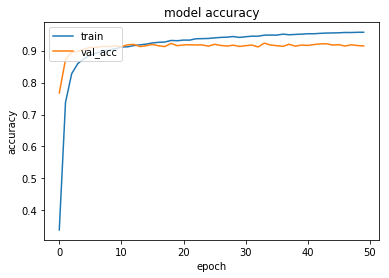

# Vietnamese text classifier using LSTM model
[](https://github.com/DucLeTrong/vienamese-text-classify)
## About data set
The Vietnamese dataset consists of 10 different topics
- [VNTC](https://github.com/duyvuleo/VNTC)

## Training
- Install requirement
```
>> pip install -r requirements.txt
```
- Prepare data:
```
>> cd data/ && unrar x -r Test_Full.rar && unrar x -r Train_Full.rar
>> python load_data.py
```
- Train model 
```
>> python train.py
```
## Results


- Classify text
```
>> python infer.py --prime "Đêm hôm qua, đội tuyển Việt Nam đã bay đến Trung Quốc chuẩn bị cho giải vô địch Châu Á."
```


